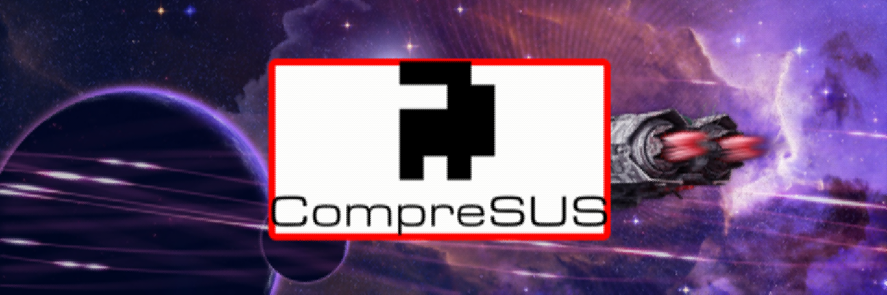
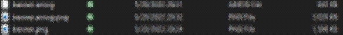
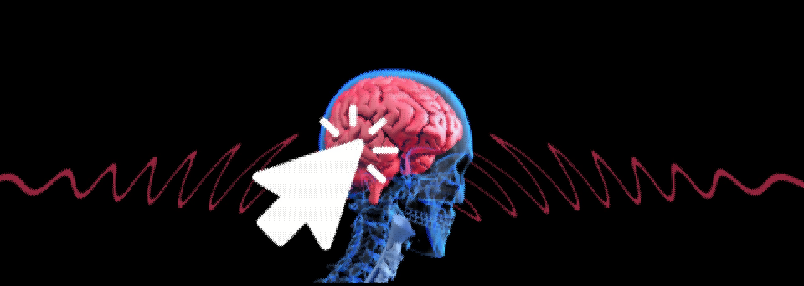

Is JPEG too normal for you? \
Do you *still* think amogus is funny? \
Then, try CompreSUS

## Table of Contents
- [Table of Contents](#table-of-contents)
- [General Info](#general-info)
- [Technologies](#technologies)
- [Inner Workings](#inner-workings)
- [Setup](#setup)
- [FAQ](#faq)

## General Info
Amogus. Amogus. Amogus. The entire picture becomes sus. \
\
This project is borne out of a deep love and desire to connect with the unfortunate spacemen featured in the hit title *Among Us*, commonly referred to as *Amogus*.
While it initially stated as a way to deepen my understanding of various image compression technologies, *(CompreSUS)[https://github.com/Pop101/CompreSUS]* has become so much more.
Staring at code for hours and hours, I have come to realize that the world of code is not as it seems.
Arrays, to the uninitiated, can seem hard to visualize, but after hours of debugging, `numpy` representation of the *amogus*, a rudimentary outline of the titillating character, takes on a newfound beauty.
The pattern of the spaceman lies deep within our eyes, a transcendant pattern that cannot, and should not, be denied.

The results are sus. There is no better descriptor. Nothing describes the utter ecstasy of zooming in on the image and seeing amogi. So many amogi.

Let him in. \
Embrace ***amogus***.

## Technologies
This project is created with:
- [Numpy](https://numpy.org/): 1.21.4
- [scikit-image](https://scikit-image.org/): 0.19.2
- [Pillow](https://github.com/python-pillow/Pillow): 8.4.0
- [deflate](https://github.com/dcwatson/deflate): 0.3.0

## Inner Workings
CompreSUS works by splitting a picture into a grid of 5x4 cells and then transformed into an unfortunate spaceman. This is encoded in a color for the amogus and a color for a background. Do this one more time with a small offset, only encoding the color of the amogus.

The resulting bytes are then slapped into deflate. Why? Because why not?

 \
*This image is perfectly legible*

The resulting image is entirely made out of amogi, which is to say, pretty sus.


## Setup
Clone the Repo \
```git clone https://github.com/Pop101/CompreSUS``` \
Enter the Repo and Install requirements \
```cd CompreSUS && sudo python3 -m pip install -r requirements``` \
Run and Enjoy. Honestly, I don't know why you'd ever want to use this.

## FAQ
**Q:** What does the sus score do? \
**A:** Increase the visibility of amogi in decompressed images.

**Q:** Why is it so slow? \
**A:** Transcendence is difficult to achieve

**Q:** Why did you build this? \
**A:** It was necessary.

**Q:** Why did you *really* build this? \
**A:** No clue.

**Q:** Why am I here? \
**A:** Good question.

**Q:** Why are you here? \
**A:** Better question.

**Q:** Are you okay \
**A:** Feeling kinda sus rn ngl no cap frfr

**Q:** Is this an april fool's joke \
**A:** If it makes you feel better about this, sure.


\
\
\
\
Made with ❤️ by [Pop101](https://github.com/Pop101/)



*By love, I really mean insanity*